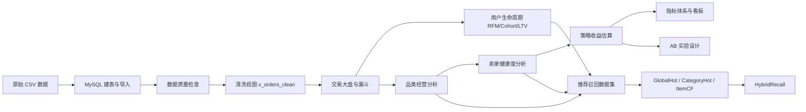
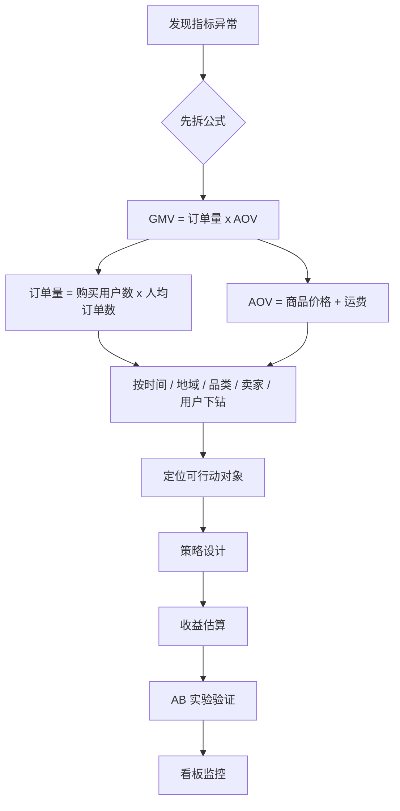

# Olist 项目流程图

> 用途: README / 项目汇报讲解中的项目结构辅助图
> 版本: 2026-06-07

## 1. 分析主线流程



## 2. 业务诊断闭环



## 3. 推荐召回原型

```mermaid
flowchart TD
    A[购买事件 interaction_events] --> B[时间切分]
    B --> C[train_interactions]
    B --> D[val_interactions]
    C --> E[训练期商品特征 product_features_train]
    E --> F[GlobalHot]
    E --> G[CategoryHot]
    C --> H[ItemCF 共现矩阵]
    F --> I[HybridRecall]
    G --> I
    H --> J[Recall@K / NDCG@K / Coverage]
    I --> J
    D --> J
```

## 4. 一句话讲图

```text
这个项目从数据可信开始，先做交易和用户供给诊断，再把发现转成策略收益、看板监控和 AB 实验，最后基于购买行为构建推荐召回原型。
```
